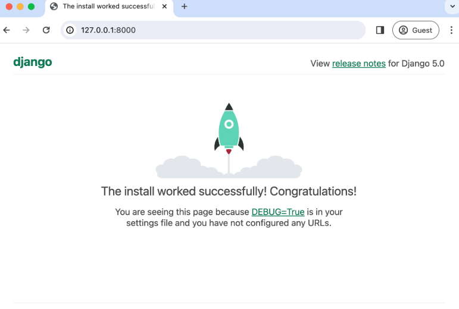

最近在開發一個 sideproject 接觸到了 Django
因此邊做專案同時記錄一下相關問題與知識
讓我們從零開始一起學習吧！

---

Django 是 Python 最受歡迎的 Web 框架之一
提供 **高效開發、強大的 ORM、內建管理介面、以及安全性機制**
適合快速開發可擴展的 Web 應用

## Django 的優勢

Django 之所以受到開發者喜愛，主要是因為它具備以下特點：

✔ **快速開發** - 內建強大的管理介面，開發速度快
✔ **MVC 架構** - 遵循 Model-View-Controller（Django 稱為 MVT）
✔ **強大 ORM** - 內建的 Object-Relational Mapping 讓你不需要直接寫 SQL
✔ **高度安全** - 內建 CSRF 防護、XSS 防護、SQL 注入防護
✔ **可擴展性** - 支援模組化開發，易於擴展

關於提到的 MVC、ORM 以及 CSRF 未來會寫文章補充
本篇文章主要介紹 **如何使用 Django 建立基本專案**
讓我們一起從環境設定到完成啟動伺服器！

---

## 1. 安裝 Python

在開始 Django 開發前，先確認已安裝 Python。

### **檢查 Python 是否已安裝**

在終端機或命令提示字元中輸入以下指令，檢查是否已安裝 Python：

```bash
python --version
```

如果未顯示 Python 版本號，表示你的電腦尚未安裝 Python，前往 [Python 官方網站](https://www.python.org/downloads/) 下載並安裝最新版本。

安裝後，再次執行 `python --version` 確保已安裝成功。

---

## 2. 設定虛擬環境並安裝 Django

開發 Django 專案時，我建議使用虛擬環境
這樣可以確保專案的可攜性與一致性
讓未來共同開發時能確保協作人快速安裝依賴
我這邊使用的是**Poetry** 來建立虛擬環境並管理依賴套件

### **安裝 Poetry**

如果尚未安裝 Poetry，可以執行以下指令安裝：

```bash
curl -sSL https://install.python-poetry.org | python3 -
```

安裝後，請確認 Poetry 是否可用：

```bash
poetry --version
```

### **建立專案與虛擬環境**

使用 Poetry 來建立 Django 專案：

```bash
poetry new mysite
cd mysite
poetry init
```

接著啟動虛擬環境並安裝 Django：

```bash
poetry add django
```

Poetry 會自動建立 `pyproject.toml` 與 `poetry.lock` 來管理相依套件。

若要啟動 Poetry 虛擬環境：

```bash
poetry shell
```

這時候，終端機前面應該會出現 `(mysite)`，表示已成功進入虛擬環境。
之後記得每次開始修改專案前
**一定要先啟動虛擬環境**！

---

## 3. 建立 Django 專案

### **步驟 1：建立專案**

```bash
django-admin startproject mysite .
```

這會在當前資料夾內建立一個名為 `mysite` 的 Django 專案。

### **步驟 2：專案結構**

```
mysite/
├── manage.py  # Django 管理指令
├── mysite/
│   ├── __init__.py
│   ├── settings.py  # 設定檔
│   ├── urls.py  # 路由設定
│   ├── asgi.py
│   ├── wsgi.py
│   ├── db.sqlite3  # SQLite 預設資料庫
```

---

## 4. 啟動 Django 伺服器

我們可以使用以下指令來啟動開發伺服器，確認專案是否成功運行。

```bash
python manage.py runserver
```

若成功，終端機會顯示：

```
Starting development server at http://127.0.0.1:8000/
```

打開瀏覽器並輸入 `http://127.0.0.1:8000/`，你應該會看到 Django 的歡迎畫面。


---

## 5. 建立 Django 應用程式

Django 使用 **應用程式 (App)** 來組織程式碼，以下是建立應用程式的方式。
未來如果要建立新的功能
都要建立一個全新的 app 再進行整合

```bash
python manage.py startapp blog
```

這會在專案內新增一個 `blog/` 目錄，結構如下：

```
blog/
├── migrations/  # 資料庫遷移
├── __init__.py
├── admin.py  # Django 管理後台
├── apps.py  # 應用設定
├── models.py  # 資料庫模型
├── tests.py  # 測試
├── views.py  # 處理請求
```

接下來，記得在 `mysite/settings.py` 內註冊這個應用程式：

```python
INSTALLED_APPS = [
    'django.contrib.admin',
    'django.contrib.auth',
    'django.contrib.contenttypes',
    'django.contrib.sessions',
    'django.contrib.messages',
    'django.contrib.staticfiles',
    'blog',  # 新增的應用程式
]
```

---

## 6. 總結

這篇文章介紹了 **如何使用 Django 建立專案**，並完成基本環境設定。

✔ **使用 Poetry 建立虛擬環境並安裝 Django**
✔ **使用 Django 建立專案**
✔ **啟動開發伺服器並確認 Django 運行正常**
✔ **建立 Django 應用程式並註冊到專案中**

下一篇文章將探討 **Django Models 與資料庫設定**，讓我們的網站開始運作！ 🚀
如果有任何問題歡迎下面留言討論！
