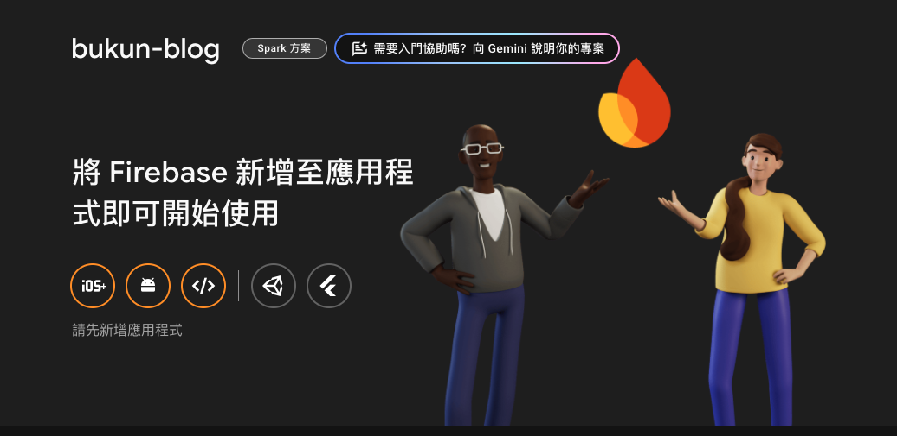

本篇文章將介紹如何透過 Firebase Analytics，在文章顯示瀏覽次數。

做完網站後覺得很想讓文章中顯示瀏覽量
研究了目前使用的主題的相關設置
發現 Hugo Blowfish 主題提供了多種自訂功能，其中也支援 **Firebase** 來追蹤網站的瀏覽量。
如果想知道更多設定請參閱[Blowfish-Firebase 設置](https://blowfish.page/docs/firebase-views/)
接下來我們一步一步進行設定

## 1. 建立 Firebase 專案

如果還沒有 Firebase 帳戶，先前往 [Firebase 官方網站](https://firebase.google.com/) 註冊並建立專案。

### **步驟 1: 新增 Firebase 專案**

1. 登入 [Firebase 控制台](https://console.firebase.google.com/)。
2. 點擊 **新增專案**，輸入你的專案名稱。
3. 選擇 **不啟用 Google Analytics**（如果只是用來統計瀏覽數量）。
4. 完成專案建立。

### **步驟 2: 取得 Firebase 設定**



1. 進入 Firebase 專案後，點擊 **專案設定**。
2. 在 **常規設定** -> **你的應用程式**，新增一個 Web 應用程式。
3. 記下 `Firebase Config` 內的 API Key 及其他資訊。

## 2. 在 Hugo Blowfish 啟用 Firebase

### **步驟 1: 新增 Firebase 設定至 `params.toml`**

在 Hugo 的 `params.toml` 檔案中加入 Firebase 設定：

```toml
[params]
  apiKey = "您的 apiKey"
  authDomain = "您的 authDomain"
  projectId = "您的 projectId"
  storageBucket = "您的 storageBucket"
  messagingSenderId = "您的 messagingSenderId"
  appId = "您的 appId"
  measurementId = "您的 measurementId"
```

### **步驟 2: 修改 article 設定**

在 Hugo 的 `params.toml` 檔案中找到 article 相關
並將瀏覽量設定打開

```toml
[article]
  showViews = true  #預設回false
  showLikes = false #如果想開也可以調整成true
```

## 3. 設定文章瀏覽數統計

### **步驟 1: 建立 Firestore 資料庫**

1. 在 Firebase 控制台，進入 **Firestore Database**。
2. 選擇 **啟用 Firestore**。
3. 點選 **Role**

將代碼置換成如下

```toml
rules_version = '2';
service cloud.firestore {
  match /databases/{database}/documents {
    match /{document=**} {
      allow read, write: if request.auth != null;
    }
  }
}
```

## 4. 總結

現在網站就已成功整合 Firebase，並能夠顯示每篇文章的瀏覽次數。
啟動網站看看是否有成功！

```bash
hugo server --disableFastRender
```

這不僅能幫助了解讀者行為，也能增加互動性
若是有其他主題也想增加瀏覽量按鈕
歡迎留言提出，我會再後續增加通用的瀏覽量觀看方式！
