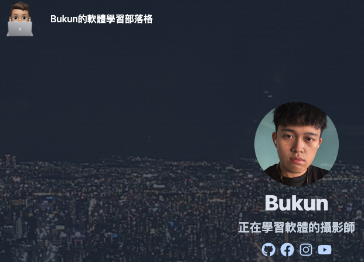

本篇文章將繼續介紹如何調整 Hugo 主題，讓網站符合需求。
`Blowfish` 是這篇文章的範例主題，也是我正在使用的主題！
如果你還沒建立 Hugo 網站，請參閱[這一篇文章]()
如果想進一步了解`Blowfish`，可以參考 [Blowfish 官方文件](https://blowfish.page/)。

## 1. 基本設定

Hugo 的主要設定檔是 `config.toml`或`hugo.toml`，這裡定義了網站的基本資訊、語言、主題等。
而每個主題下載後，都會產生一個`themes/下載的主題`

### **複製主題設定檔**

建議直接複製主題內的 `config/` 資料夾，以確保設定完整。

```bash
cp -r themes/blowfish/exampleSite/* .
```

這將會覆蓋 `config.toml`，並讓網站的設定與官方範例一致。

### 設定`hugo.toml`

在 hugo.toml 中設定網站的基本資訊

```toml
baseURL = "https://example.com/" #未來部署需更改
languageCode = "zh-TW"
title = "我的 Hugo 網站"
theme = "blowfish" # 根據主題改變  重要
paginate = 10  # 設定每頁顯示的文章數量
```

確保 `theme` 設定正確，否則網站將無法正確載入！

### 調整`languages.toml`

如果網站有多語系需求，可以調整 `languages.toml` 來設定語言和網站標題。

```toml
languageCode = "zh-tw"    #使用的語言
languageName = "繁體中文"
weight = 1
title = "Bukun的軟體學習部落格"  #網站navbar顯示的名稱
```

### **修改網站 Logo 和簡介**

```toml
[params]
  logo = "img/logo.png"       #此為navbar顯示的圖像
  description = "軟體學習部落格"
```

### **關於作者**

```
[params.author]
  name = "Bukun"  #你的名字
  image = "img/author.png"   #你的大頭貼
  headline = "正在學習軟體的攝影師"  #你的標語
  bio = "慢慢學習，持續成長"  #你的簡介
```

確保圖片放在 `mysite/assets/img` 內，否則無法顯示！

```
mysite/assets/img
├── logo.png        # 你的圖像
├── author.png        # 你的大頭貼
```

這樣應該就能看見主頁的簡單架構已經出來囉！


## 2. 設定導覽列

### `menus.toml`

如果想要修改網站導覽列，可以在 `config/_default/menus.toml` 內加入：

```toml
[[main]]
  identifier = "home"
  name = "主頁"       #顯示的名稱
  url = "/"           #導向的頁面
  weight = 1

[[main]]
  identifier = "blog"
  name = "文章"         #顯示的名稱
  url = "/posts/"      #導向的頁面
  weight = 2

[[main]]
  name = "分類"         #顯示的名稱
  url = "/categories/" #導向的頁面
  weight = 3
```

這樣就能在導覽列顯示「主頁」、「文章」和「分類」的連結。


## 3. 自訂樣式 (`custom.css`)

如果你想要進一步修改 Blowfish 主題的樣式
也可以在 `assets/css/custom.css` 內加入 CSS 來覆蓋預設樣式。

```css
body {
  background-color: #222;
  color: #f5f5f5;
}
```

## 總結

以上介紹了如何調整 Hugo Blowfish 主題，包括 `config.toml`、`languages.toml`、`menus.toml`、以及自訂 CSS 樣式。
下一篇文章會進一步介紹**`params.toml`** ，讓網站更加個人化！
如果想要進一步優化，可以客製化 `layouts/` 內的檔案，打造完全符合需求的 Hugo 網站！
